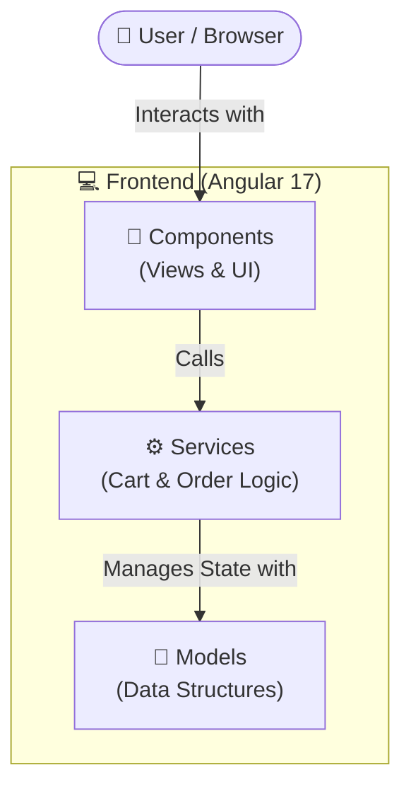

# 🍔 Food Delivery Application

A modern, responsive, and fully functional **Food Delivery application** built using **Angular 17** and **Modern CSS**.

This project uses **mock data services** to simulate real-world data interactions like browsing restaurants, viewing menus, adding to cart, and checking out orders without needing a backend server.

---

# ✨ Features

### 🔍 Restaurant Browsing
View a comprehensive list of available restaurants with mock data including cuisine types and ratings.

### 📄 Menu Details
Click into individual restaurants to view in-depth details of their menu items, descriptions, and prices.

### 🛒 Cart Management
Users can add items to their cart, view total prices in real-time, and easily clear their cart.

### 💳 Checkout
A dedicated checkout page for users to place their orders with a simulated delivery address form.

### 📦 Order Tracking
Monitor order status from 'Pending' to 'Delivered' using a mock order management system.

### 🎨 Clean UI/UX
Styled using **Modern CSS** for a clean, responsive, and intuitive design without relying on heavy external libraries.

---

# 🛠 Technology Stack

| Technology | Description |
|------------|-------------|
| Angular | Frontend framework |
| CSS | Styling |
| TypeScript | Programming Language |
| Karma/Jasmine | Unit testing |

**Versions Used**

- Angular `v17.3.0`
- Node.js `v18+`
- npm `v9+`

---

## 🏗️ Architecture Diagram



---

# 🚀 Getting Started

Follow the instructions below to run the project locally.

---

# 📋 Prerequisites

Make sure you have the following installed:

### Install Node.js
Download from:

```text
[https://nodejs.org](https://nodejs.org)
```

Check versions:

```bash
node -v
npm -v
```

### Install Angular CLI

```bash
npm install -g @angular/cli@17
```

Verify installation:

```bash
ng version
```

---

# 📥 Installation

### 1️⃣ Clone the repository

```bash
git clone https://github.com/Karthikr0815/Food-delivery-app.git
```

### 2️⃣ Navigate to the project folder

```bash
cd Food-delivery-app
```

### 3️⃣ Install project dependencies

```bash
npm install
```

---

# 💻 Run the Project Locally

Run the following command in the project root folder:

```bash
npm start
```

or

```bash
ng serve
```

Angular development server will start at:

```text
http://localhost:4200
```

---

# 🌐 Open the Application

Once the server is running, open your browser:

```text
http://localhost:4200
```

The application supports **live reload**, so changes in code will automatically refresh the page.

---

# 📂 Project Structure

```text
Food-delivery-app
│
├── src/
│   ├── app/
│   │   ├── components/
│   │   │   ├── cart
│   │   │   ├── checkout
│   │   │   ├── menu-list
│   │   │   ├── navbar
│   │   │   ├── order-status
│   │   │   └── restaurant-list
│   │   │
│   │   ├── models/
│   │   │   └── models.ts
│   │   │
│   │   ├── services/
│   │   │   ├── cart.service.ts
│   │   │   └── order.service.ts
│   │   │
│   │   └── app.routes.ts
│   │
│   └── index.html
│
└── package.json
```

---

# 📦 Important Files

### `src/app/models/models.ts`

Defines the core data structures for the application:
* `Restaurant`
* `MenuItem`
* `Order`

### `src/app/app.routes.ts`

Defines the **application routing** to navigate between restaurants, menus, cart, and checkout.

### `src/app/services/`

Contains the Angular services that manage the business logic and state for the shopping cart and user orders.

---

# 🧪 Testing

Run unit tests using **Karma/Jasmine**:

```bash
npm run test
```

---

# 📦 Build for Production

To generate a production build:

```bash
npm run build
```

The compiled files will be generated inside:

```text
dist/food-delivery-app
```

---

# 👨‍💻 Development Notes

* Pure CSS is used for styling the UI components, keeping the framework lightweight.
* Mock services using RxJS handle data operations to simulate backend interactions.
* The application leverages Angular 17's standalone components for cleaner module management.

---

# ⭐ Future Improvements

* Real backend integration (e.g., Node.js / Express or Spring Boot)
* Payment Gateway Integration (Stripe / Razorpay)
* User Authentication & Authorization
* Dynamic Restaurant Ratings and Reviews
* Real-time Delivery Tracking Map
